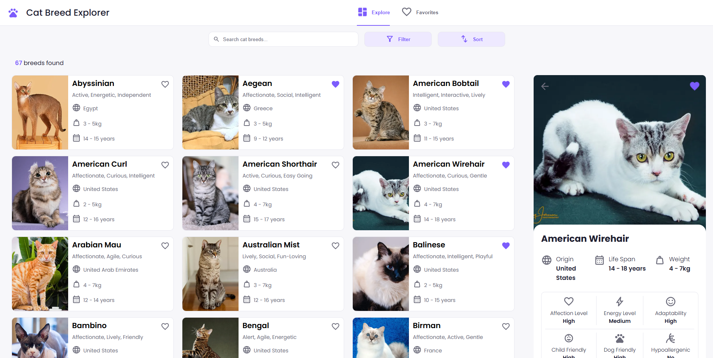
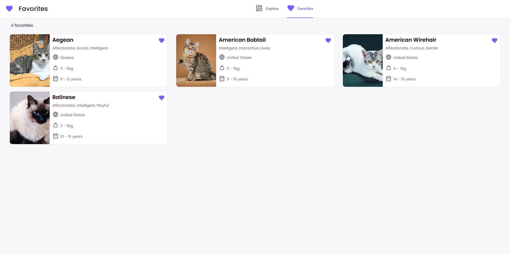
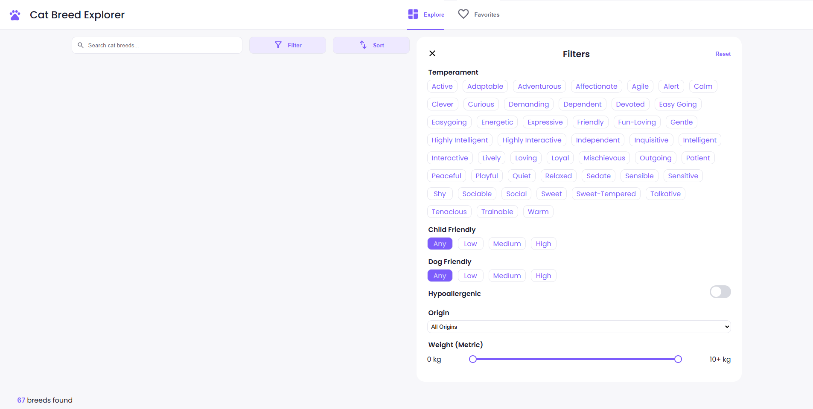
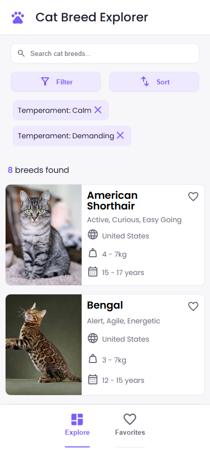
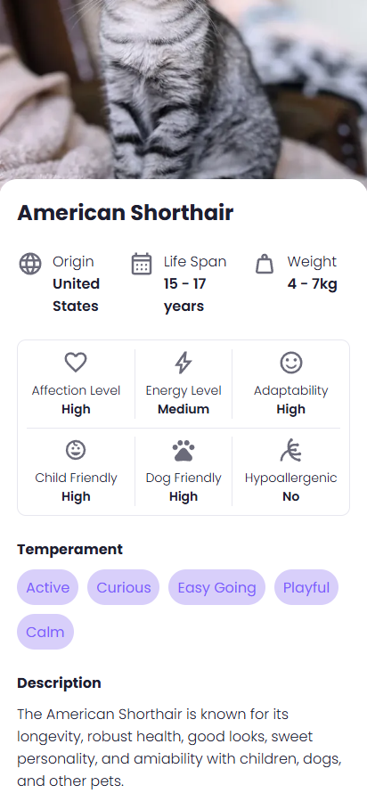

# Cat Breed Explorer

A responsive React application for exploring cat breeds from around the world.
Users can browse breeds, view detailed information, search, sort, filter, and save their favorite cats.

## Features

- Browse 67 cat breeds
- Detailed breed information
- Search breeds by name
- Filter by:
    - Temperament
    - Origin
    - Child Friendly
    - Dog Friendly
    - Hypoallergenic
    - Weight
- Sort by:
    - Name (A-Z / Z-A)
    - Weight
    - Life Span
- Favorites system
- Persistent favorites using Local Storage
- Responsive design for desktop and mobile devices

## Technologies

- React
- JavaScript (ES6+)
- Vite
- CSS3
- The Cat API

## Screenshots

<div align="left">
  
</div>
<div align="left">
  
</div>
<div align="left">
  
</div>
<div align="left">
  
  
</div>

## Installation

```bash
git clone https://github.com/Nekopawa/cats-breeds-app.git

cd cats-breeds-app

npm install

npm run dev
```

## API

This project uses The Cat API:

https://thecatapi.com/

## Future Improvements

- Dark mode
- Additional breed statistics
- Pagination
- Compare breeds

## Author

Rafaela Aline Hoffmann
